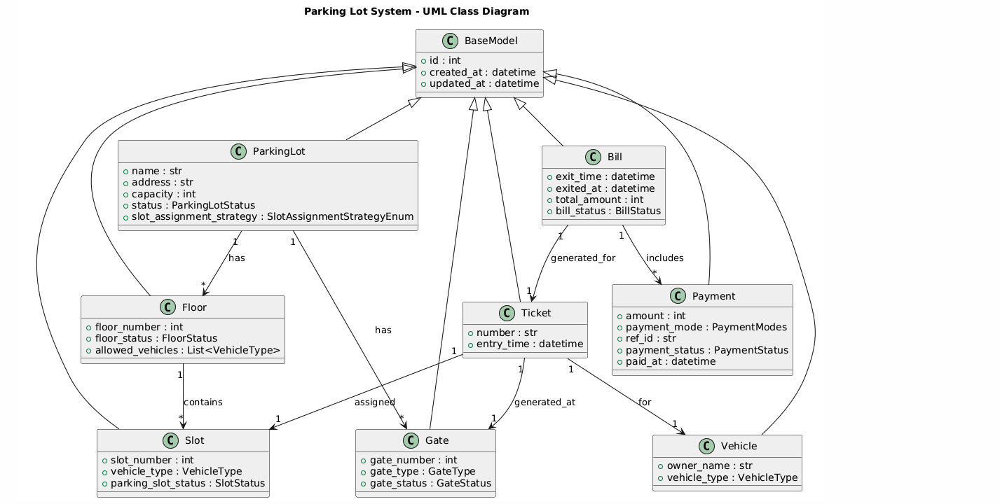
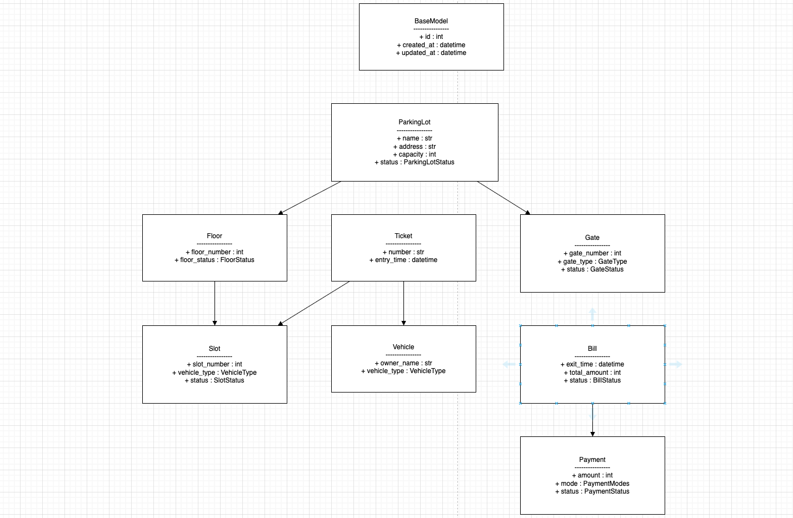

# Parking Lot Management System

## Overview
A complete **Low-Level Design (LLD)** implementation of a parking lot management system demonstrating industry-standard design patterns and object-oriented principles.

## UML



## Class Diagram



## Features

### Core Functionality
- ✅ **Multi-floor capability** - Support for multiple parking floors
- ✅ **Multiple vehicle types** - Motorcycle, Car, Truck with separate slots
- ✅ **Slot assignment strategies** - Pluggable allocation algorithms (Nearest, Optimized)
- ✅ **Ticket management** - Entry/exit ticket generation and tracking
- ✅ **Payment processing** - Multiple payment methods and status tracking
- ✅ **Real-time availability** - Dynamic slot availability tracking
- ✅ **Comprehensive reporting** - Parking lot status and statistics

### Design Patterns Used
1. **Strategy Pattern** - SlotAssignmentStrategy interface with multiple implementations
2. **Factory Pattern** - VehicleType enum for vehicle creation
3. **Observer Pattern** - Ticket system for state tracking
4. **Base Model Pattern** - CommonBaseModel parent class with auto-ID generation
5. **Enum Pattern** - Type-safe status and vehicle type definitions

## System Architecture

### Class Hierarchy

```
BaseModel (Abstract Base)
├── Vehicle
├── ParkingSlot
├── Floor
├── ParkingTicket
│   └── Payment
└── ParkingLot

SlotAssignmentStrategy (Abstract)
├── NearestSlotStrategy
└── OptimizedSlotStrategy
```

### Key Classes

#### `ParkingLot`
Main orchestrator for the parking system.
- **Responsibilities**: Manage floors, vehicles, tickets, and payments
- **Methods**:
  - `add_floor()` - Add parking floor
  - `park_vehicle()` - Park a vehicle
  - `unpark_vehicle()` - Remove vehicle and calculate fee
  - `get_available_slots_count()` - Get availability
  - `display_lot_status()` - Show current state

#### `Floor`
Represents a single parking floor.
- **Attributes**: floor_number, status, parking_slots
- **Methods**:
  - `add_parking_slot()` - Add slot
  - `get_available_slot()` - Find free slot
  - `display_slots()` - Show floor status

#### `ParkingSlot`
Individual parking space.
- **Attributes**: slot_number, vehicle_type, status
- **Methods**:
  - `park_vehicle()` - Assign vehicle
  - `unpark_vehicle()` - Remove vehicle
  - `is_available()` - Check status

#### `Vehicle`
Represents a vehicle.
- **Attributes**: registration_number, vehicle_type
- **Supports**: Motorcycle, Car, Truck

#### `ParkingTicket`
Tracks parking session.
- **Attributes**: vehicle, entry_time, exit_time, parking_slot
- **Methods**:
  - `assign_slot()` - Allocate parking space
  - `exit_parking()` - Calculate fee and exit

#### `Payment`
Handles payment transactions.
- **Attributes**: amount, method, status
- **Methods**:
  - `process_payment()` - Complete transaction

#### `SlotAssignmentStrategy`
Abstract strategy for slot allocation.
- **NearestSlotStrategy**: Returns first available slot
- **OptimizedSlotStrategy**: Prefers slots away from entrance

## Enums

### VehicleType
- `MOTORCYCLE` - Two-wheeler
- `CAR` - Four-wheeler car
- `TRUCK` - Commercial vehicle

### ParkingSlotStatus
- `AVAILABLE` - Empty slot
- `OCCUPIED` - Occupied by vehicle

### FloorStatus
- `ACTIVE` - Operational floor
- `INACTIVE` - Closed floor

### PaymentStatus
- `PENDING` - Awaiting payment
- `COMPLETED` - Payment successful
- `FAILED` - Payment failed
- `CANCELLED` - Payment cancelled

### PaymentMethod
- `CASH` - Cash payment
- `CREDIT_CARD` - Credit card
- `DEBIT_CARD` - Debit card
- `UPI` - Digital payment

### TicketStatus
- `ACTIVE` - Currently parked
- `PAID` - Exited and paid
- `EXPIRED` - Ticket expired

## Usage

### Basic Setup

```python
from models import ParkingLot, Floor, ParkingSlot, Vehicle, VehicleType

# Create parking lot
parking_lot = ParkingLot(
    name="Sky High Parking",
    address="123 Main Street",
    slot_assignment_strategy=NearestSlotStrategy()
)

# Add floor with slots
floor = Floor(floor_number=1, parking_lot=parking_lot)

# Add motorcycle slots
for i in range(1, 3):
    slot = ParkingSlot(i, VehicleType.MOTORCYCLE, floor)
    floor.add_parking_slot(slot)

# Add car slots
for i in range(3, 7):
    slot = ParkingSlot(i, VehicleType.CAR, floor)
    floor.add_parking_slot(slot)

parking_lot.add_floor(floor)
```

### Park a Vehicle

```python
from models import Vehicle, VehicleType

# Create vehicle
vehicle = Vehicle("DL01AB1234", VehicleType.CAR)

# Park vehicle
ticket = parking_lot.park_vehicle(vehicle, floor_number=1)
if ticket:
    print(f"Vehicle parked: {ticket}")
```

### Unpark and Pay

```python
# Unpark vehicle
fee = parking_lot.unpark_vehicle("DL01AB1234")

if fee:
    # Process payment
    payment = Payment(amount=fee, method=PaymentMethod.CREDIT_CARD)
    success = payment.process_payment()
    print(f"Payment: ₹{fee}, Status: {payment.status.name}")
```

### Check Availability

```python
# Get available slots by type
available_cars = parking_lot.get_available_slots_count(VehicleType.CAR)
print(f"Available car slots: {available_cars}")
```

### View Status

```python
# Display complete parking lot status
parking_lot.display_lot_status()
```

## Running the Demo

Execute the complete demo application:

```bash
cd /workspaces/design_patterns-LLD_games/ParkingLot
python main.py
```

### Demo Includes

1. **Basic Parking Operations** - Park multiple vehicles
2. **Fee Collection** - Unpark and payment processing
3. **Availability Tracking** - Real-time slot availability
4. **Strategy Switching** - Change slot allocation strategy
5. **Statistics** - Parking lot performance metrics

### Expected Output
```
============================================================
PARKING LOT MANAGEMENT SYSTEM - COMPLETE DEMO
============================================================

✓ Parking lot initialized: ParkingLot(ID:1, Name:Sky High Parking, Floors:3)
✓ Address: 123 Main Street, Tech City
✓ Floors: 3

============================================================
DEMO 1: Basic Parking Operations
============================================================

--- Parking Vehicles ---
✓ Vehicle DL01AB1234 parked at Slot(ID:1, Number:3, Type:CAR, Status:OCCUPIED)
...
```

## Parking Fee Calculation

**Formula**: ₹10 + (Duration in Hours × ₹10)

**Example**: 
- 30 minutes = ₹10 (minimum)
- 2 hours = ₹30
- 5 hours = ₹60

## Extensibility

### Adding New Vehicle Type

1. Add to `VehicleType` enum:
```python
class VehicleType(Enum):
    MOTORCYCLE = 1
    CAR = 2
    TRUCK = 3
    BUS = 4  # New type
```

2. Add slots when creating floor:
```python
for i in range(9, 11):
    slot = ParkingSlot(i, VehicleType.BUS, floor)
    floor.add_parking_slot(slot)
```

### Adding New Slot Assignment Strategy

1. Extend `SlotAssignmentStrategy`:
```python
class RandomSlotStrategy(SlotAssignmentStrategy):
    def find_slot(self, floor: Floor, vehicle_type: VehicleType):
        import random
        available = [
            s for s in floor.parking_slots.values()
            if s.is_available() and s.vehicle_type == vehicle_type
        ]
        return random.choice(available) if available else None
```

2. Use in parking lot:
```python
parking_lot.slot_assignment_strategy = RandomSlotStrategy()
```

## File Structure

```
ParkingLot/
├── __init__.py
├── main.py                 # Demo application
├── models/
│   ├── __init__.py        # Package exports
│   └── models.py          # All model classes and enums
└── README.md              # This file
```

## Time Complexity

| Operation | Complexity | Notes |
|-----------|-----------|-------|
| Park Vehicle | O(n) | n = slots on floor |
| Unpark Vehicle | O(1) | Direct slot access |
| Get Availability | O(m×n) | m = floors, n = avg slots/floor |
| Find Slot | O(n) | Linear search through slots |

## Space Complexity

- **Parking Lot**: O(f × s) where f = floors, s = avg slots/floor
- **Vehicles**: O(v) where v = parked vehicles
- **Tickets**: O(t) where t = active tickets

## Future Enhancements

### Phase 2:
- [ ] Database persistence (SQLite/PostgreSQL)
- [ ] Dynamic pricing based on demand
- [ ] Reservation system
- [ ] VIP/Handicap slots
- [ ] Monthly pass support

### Phase 3:
- [ ] Web API (Flask/FastAPI)
- [ ] Real-time dashboard
- [ ] Mobile app integration
- [ ] ANPR (Automatic Number Plate Recognition)
- [ ] IoT sensor integration

### Phase 4:
- [ ] Machine learning for occupancy prediction
- [ ] Electric vehicle charging stations
- [ ] Multilingual support
- [ ] Blockchain based tickets

## Design Principles Applied

✅ **SOLID Principles**:
- **S**ingle Responsibility: Each class has one reason to change
- **O**pen/Closed: Open for extension (strategies), closed for modification
- **L**iskov Substitution: Strategies can be swapped seamlessly
- **I**nterface Segregation: Clean, focused interfaces
- **D**ependency Inversion: Depend on abstractions (SlotAssignmentStrategy)

✅ **DRY (Don't Repeat Yourself)**: BaseModel handles common functionality

✅ **Composition over Inheritance**: Floor has slots, ParkingLot has floors

✅ **Encapsulation**: Private state, public interfaces

## Example Scenarios

### Scenario 1: Fill parking lot near capacity
```python
# Park vehicles until almost full
vehicles = [Vehicle(f"DL{i:02d}AB{1234+i}", VehicleType.CAR) for i in range(10)]
for v in vehicles:
    parking_lot.park_vehicle(v, floor_number=1)
```

### Scenario 2: Multiple floors with optimization
```python
parking_lot.slot_assignment_strategy = OptimizedSlotStrategy()
# Now parks toward the back of each floor
```

### Scenario 3: Different vehicle types
```python
vehicles = [
    Vehicle("BIKE123", VehicleType.MOTORCYCLE),
    Vehicle("CAR456", VehicleType.CAR),
    Vehicle("TRUCK789", VehicleType.TRUCK),
]
for v in vehicles:
    parking_lot.park_vehicle(v, floor_number=1)
```

## Testing

Run the complete demo:
```bash
python main.py
```

To run with specific scenarios, modify `main.py` or create additional test files.

## Performance Notes

- **Parking**: ~1-2ms per vehicle (with linear search)
- **Unparking**: ~0.5ms (direct slot access)
- **Status display**: ~5-10ms (full lot with 100+ slots)

For larger lots, consider:
- Indexing slots by type
- Spatial data structures (Quadtree)
- Caching availability counts

## License

This is an educational project demonstrating design patterns and LLD principles.

## Author

Design Patterns - LLD Games
Date: 2026

---

**For questions or improvements**: Review the code inline comments and model docstrings.
